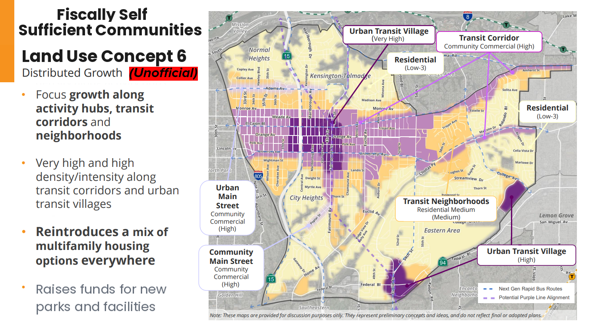

# Information

Mid-City is currently in the middle of a community plan update that will shape how the area develops for decades to come. While there are multiple existing preliminary proposals for how to rezone the area, none of them go far enough. This area has multiple high quality transit corridors, with more on the way, and as such deserves a planned land use that reflects that, and allows the area to grow both environmentally and fiscally sustainably. This new, community-created plan would much better accomplish this goal, and allow Mid-City to become truly fiscally self sufficient.

# Content

Subject: Support for the Community-Developed Distributed Growth Concept (Alternative 6)

Dear Planning Department Staff,

I am writing to express strong support for the community-developed Distributed Growth concept (Alternative 6) that has been circulating among residents as part of the broader discussion around the Mid-City Community Plan Update. While this concept is not an official alternative currently included in the City’s Mid-City Community Plan Update materials, I believe it reflects many of the planning principles that residents are hoping to see incorporated into the final plan.

This concept represents a thoughtful and forward-looking framework that could deliver significant long-term benefits for Mid-City residents.

I strongly urge the Planning Department to maximize density wherever possible within this type of framework, particularly in areas with the strongest potential for transit-oriented, walkable, mixed-use communities. Mid-City is already one of San Diego’s most transit-rich areas, and land use decisions should fully reflect and leverage that reality.

Specifically, I encourage the City to:
    •    Maximize residential density and mixed-use intensity along major transit corridors, including El Cajon Boulevard and other high-ridership routes.
    •    Concentrate the highest levels of housing in Urban Transit Village areas, where proximity to transit, services, and jobs makes car-light living possible.
    •    Encourage compact, walkable development patterns that support local businesses, active transportation, and public transit ridership.
    •    Ensure zoning capacity matches the long-term housing needs of Mid-City and the broader region.
A financially self-sufficient communities approach is one of the strongest planning frameworks available for Mid-City. By directing growth toward activity centers and transit corridors, the City can create neighborhoods where new development helps support parks, public facilities, mobility improvements, and community infrastructure. This type of framework ensures that growth strengthens the neighborhood rather than placing additional strain on existing resources.

Distributed growth also avoids the pitfalls of concentrating development too narrowly. Instead, it strategically spreads opportunity across activity hubs and corridors, allowing Mid-City to grow while maintaining vibrant, diverse neighborhoods.

Mid-City residents deserve a plan that is ambitious, forward-looking, and aligned with the City’s climate, housing, and transportation goals. The ideas reflected in this community-developed concept move strongly in that direction, and I hope the Planning Department will consider incorporating these principles as the Mid-City Community Plan continues to evolve.

For reference, I have attached the community-created Alternative 6 concept — the “Financially Self-Sufficient Communities” distributed growth framework — which illustrates how these ideas could be applied geographically across Mid-City.

Thank you for your work on the Mid-City Community Plan and for considering community-driven ideas like this one.

Sincerely,

{{your_name}}

---
